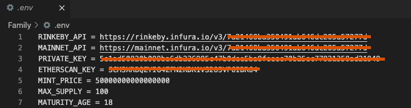

# 👪 'Family' NFT collection 👫
> There is one contract Family.sol with ERC721 standard implementation. Collection has 4 types of tokens: MAN, WOMAN, KID_BOY and KID_GIRL


## 📁 Table of Contents
* [General Info](#-general-information)
* [Technologies Used](#-technologies-used)
* [Features](#-features)
* [Requirements For Initial Setup](#-requirements-for-initial-setup)
* [Setup](#-setup)
* [Contact](#-contact)


## 🚩 General Information
- Contract allows users to mint standard ERC721 tokens of type MAN or WOMAN with mintHuman() function
- If the user has both MAN and WOMAN tokens he can create a KID token with breeding() function
- In the contract each real day is equal to one year and the owner can set the maturity age
- When the KID token reaches maturity age and its checked via checkAgeChanging() function this token become adult MAN or WOMAN token

 
## 💻 Technologies Used
- hh coverage
- slither
- docgen
- solhint

## 🌟 Features
- Users could create 'Family'
- Owner set all variables: mint price, maturity age etc.
- 100% coverage of tests

## 👀 Requirements For Initial Setup
- Install [NodeJS](https://nodejs.org/en/), should work with any node version below 16.16.0
- Install [Hardhat](https://hardhat.org/)

## 📟 Setup
### 1. 💾 Clone/Download the Repository
### 2. 📦 Install Dependencies:
```
$ cd repository_file
$ npm install
```
### 3. 🔍  .env environment variables required to set up
Create .env file inside project folder
- You can get your ethereum or testnet API key [here](https://infura.io/dashboard/ethereum),[here](https://www.alchemy.com) or any other service that allow you to connect to the nodes
- You can get your private key from your wallet(⚠️Don't share your private key with untrusted parties) 
- You can get your etherscan API -key [here](https://etherscan.io/myapikey).
```
RINKEBY_API = <rinkeby API key>
MAINNET_API = <Ethereum mainnet API key>
PRIVATE_KEY = <Private key of your wallet u want to deploy contracts from>
ETHERSCAN_KEY = <Etherscan API key in order to verify your contracts>
MINT_PRICE = <Constructor parameter mint price in ETH in wei(example: 0.05 ETH = 50000000000000000 wei)>
MAX_SUPPLY = <Constructor parameter max limit of tokens to be minted>
MATURITY_AGE = <Constructor parameter age when token will change from KID type to ADULT type>
```



### 4. ⚠️  Run Tests
```
$ npm run test
```

```
$ npm run coverage
```

### 5. 🚀 Deploy to Rinkeby or Mainnet
```
$ npm run rinkeby
``` 
```
$ npm run mainnet
``` 

### 6. ✏️ Insert current contract address into package.json
```
"verify:rinkeby": "npx hardhat verify --network rinkeby --contract contracts/Family.sol:Family --constructor-args helpers/arguments.js <Family.sol address>",
"verify:mainnet": "npx hardhat verify --network ethereum --contract contracts/Family.sol:Family --constructor-args helpers/arguments.js <Family.sol address]>"
``` 


### 7. 📜 Verify contracts
```
$ npm run verify:rinkeby
```

or for mainnet

```
 $ npm run verify:mainnet
```


## 💬 Contact
Created by [@LESKOV](https://www.linkedin.com/in/ivan-lieskov-4b5664189/) - feel free to contact me!
